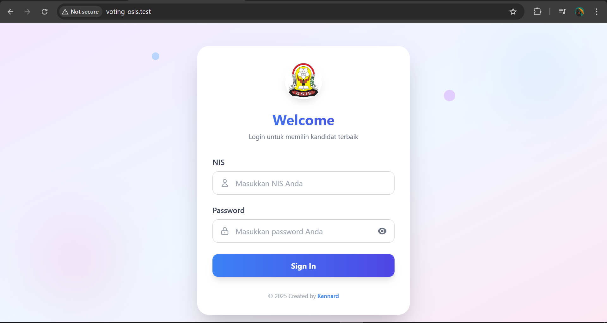
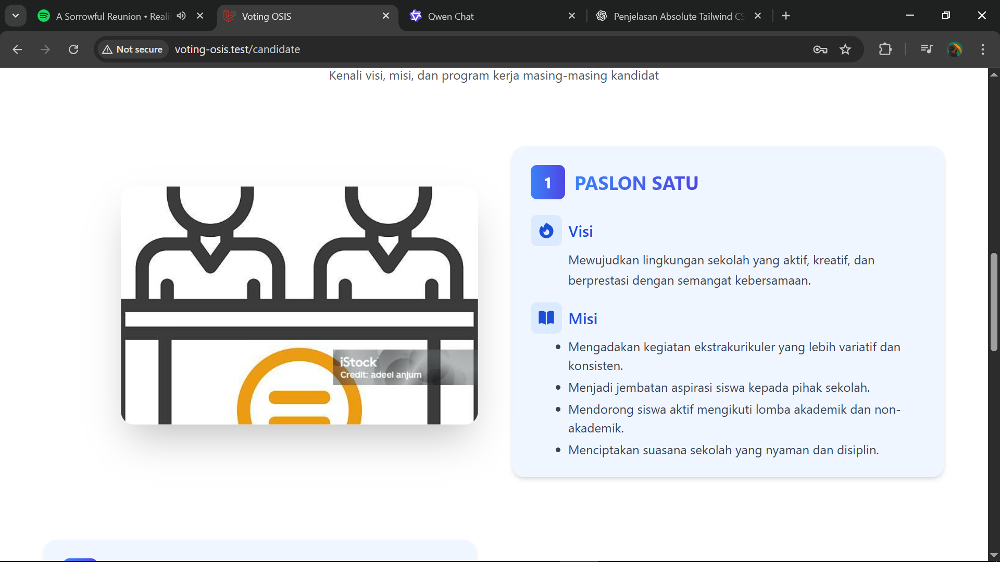
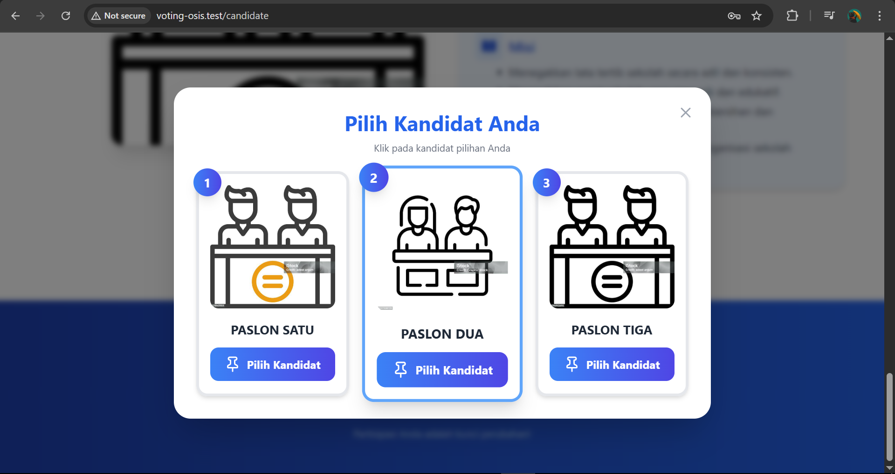
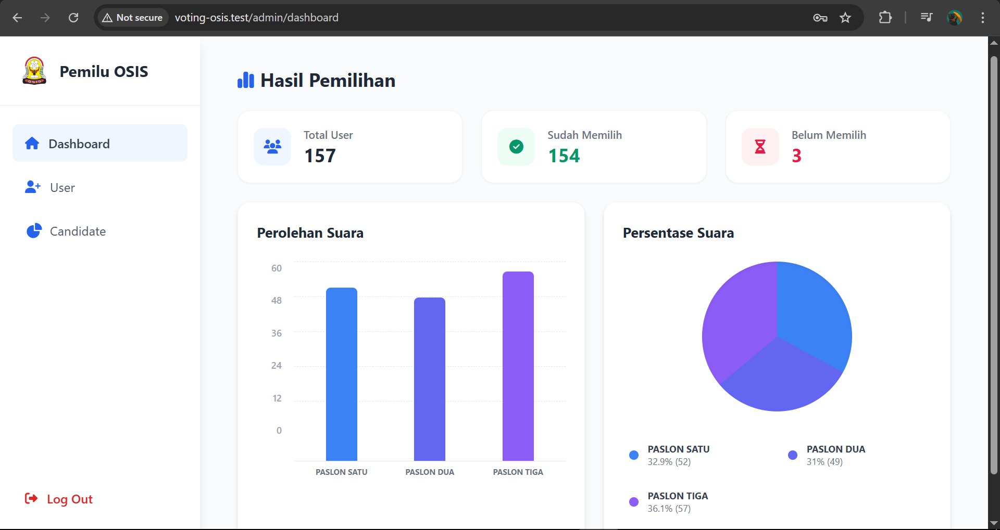

# Voting OSIS

**Voting OSIS** adalah sistem voting online untuk pemilihan pengurus OSIS dengan tampilan modern, interaktif, dan responsif.  
Web ini memudahkan siswa memilih kandidat dan memungkinkan admin memantau hasil voting secara real-time.

---

## Fitur Utama

-   **Login & Autentikasi Pengguna**  
    Hanya siswa terdaftar yang dapat melakukan voting.

-   **Antarmuka Pemilihan Kandidat yang Intuitif**  
    Desain bersih dan mudah digunakan.

-   **Animasi Confetti Saat Vote Berhasil**  
    Memberikan pengalaman interaktif dan menyenangkan setelah suara dikirim.

-   **Dashboard Admin Real-Time**  
    Tampilkan jumlah suara per kandidat yang diperbarui otomatis tanpa reload.

-   **Interaktivitas Tanpa JavaScript Berat**  
    Menggunakan **Livewire** dan **Alpine.js** untuk pengalaman smooth.

---

## Teknologi yang Digunakan

-   **Laravel** – Framework PHP untuk backend.
-   **Livewire** – Membuat komponen interaktif tanpa menulis banyak JavaScript.
-   **Tailwind CSS** – Styling modern dan responsif.
-   **Alpine.js** – Animasi dan interaktivitas ringan.
-   **Blade Templates** – Template engine bawaan Laravel.

---

## Cara Instalasi

Buka terminal di folder project, lalu **copy-paste seluruh blok berikut sekaligus**:

```bash
git clone https://github.com/username/voting-osis.git
cd voting-osis
composer install
npm install
npm run dev
cp .env.example .env
php artisan key:generate
php artisan migrate --seed
php artisan serve
```

---

## Cara Penggunaan

1. Buka browser dan akses:
   http://127.0.0.1:8000

2. Login menggunakan akun siswa yang telah terdaftar.

3. Pilih kandidat OSIS yang diinginkan.

4. Klik tombol Vote, sistem akan menampilkan konfirmasi sukses dengan animasi.

5. Admin dapat mengakses Dashboard Admin untuk melihat hasil voting secara real-time tanpa perlu refresh halaman.

---

## Screenshot

### Halaman Login



### Daftar Kandidat



### Konfirmasi Voting



### Dashboard Admin


